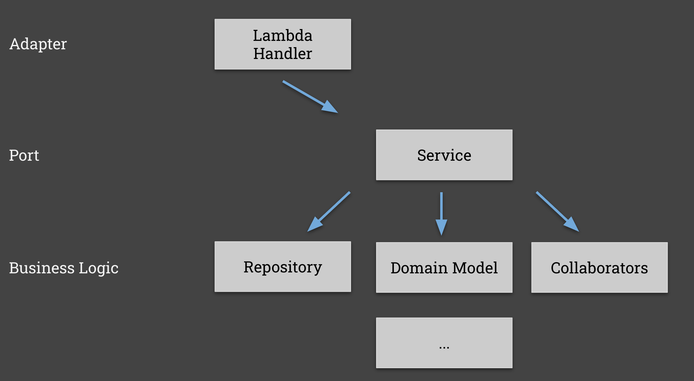

# Example NodeJS SNS Provider

 (latest pact)

 (prod/prod pact)

This is an example of a Node provider that uses Pact, [Pactflow](https://pactflow.io) and Travis CI to ensure that it is compatible with the expectations its consumers have of it.

It is using a public tenant on Pactflow, which you can access [here](https://test.pactflow.io) using the credentials `dXfltyFMgNOFZAxr8io9wJ37iUpY42M`/`O5AIZWxelWbLvqMd8PkAVycBJh2Psyg1`. The latest version of the Example Consumer/Example Provider pact is published [here](https://test.pactflow.io/pacts/provider/pactflow-example-provider-js-sns/consumer/pactflow-example-consumer-js-sns/latest).

In the following diagram, we'll be testing the "Product Event API", a simple HTTP service that receives product updates via a REST API and publishes product events on the `product` topic.

We need to be able to test that we are able to produce valid events to the SNS topic that matches what the consumer(s) can handle:

## Theory

Modern distributed architectures are increasingly integrated in a decoupled, asynchronous fashion. Message queues such as ActiveMQ, RabbitMQ, SNS, SQS, Kafka and Kinesis are common, often integrated via small and frequent numbers of microservices (e.g. lambda).

Pact supports these use cases, by abstracting away the _protocol_ and focussing on the messages passing between them.

To reiterate: Pact does not know about the various message queueing technologies - there are simply too many! And more importantly, Pact is really about testing the _messages_ that pass between them, you can still write your standard _functional_ tests using other frameworks designed for such things.

When writing tests, Pact takes the place of the intermediary (MQ/broker etc.) and confirms whether or not the consumer is able to _handle_ a given event, or that the provider will be able to _produce_ the correct message.

### How to write tests?

We recommend that you split the code that is responsible for handling the protocol specific things - in this case the SNS publishing code - and the piece of code that actually *produces* payload.

You're probably familiar with layered architectures such as Ports and Adaptors (also referred to as a Hexagonal architecture). Following a modular architecture will allow you to do this much more easily:

This code base is setup with this modularity in mind (key files):

* [REST API](server.js)
* [Event Service (SNS Producer)](src/product/product.event.service.js)
* Business Logic
   * [Product](src/product/product.js)
   * [Event Producer](src/product/product.event.js)

The target of our [provider pact test](src/product/product.pact.test.js) is the [Event Producer](src/product/product.event.js), which is responsible for producing a Product update event, that the Event Service will publish to SNS.

See also:

* https://dius.com.au/2017/09/22/contract-testing-serverless-and-asynchronous-applications/
* https://dius.com.au/2018/10/01/contract-testing-serverless-and-asynchronous-applications---part-2/

## Pre-requisites

**Software**:

* [AWS SAM](https://docs.aws.amazon.com/serverless-application-model/latest/developerguide/serverless-sam-cli-install-mac.html)
*  https://docs.pactflow.io/docs/workshops/ci-cd/set-up-ci/prerequisites/

## Usage

See also the [Pactflow CI/CD Workshop](https://github.com/pactflow/ci-cd-workshop) for more background.

### Testing
* Run the Pact tests: `make test`

### Running  locally

* Start the Provider API (with a local SNS setup with localstack): `make start`
* Create a product: `make create-product`
* Update a product: `make update-product`
* Delete a product: `make delete-product`